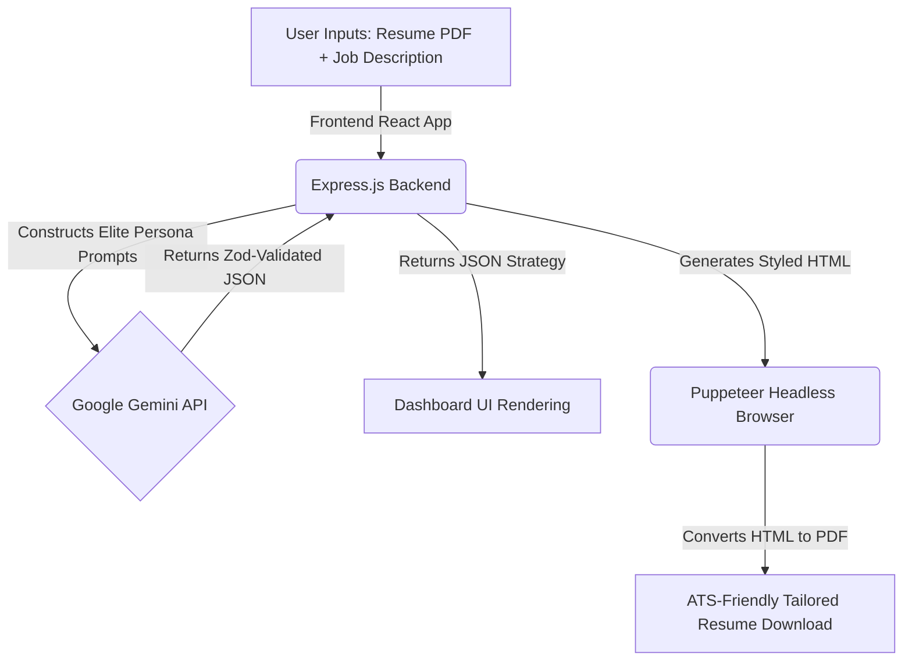

# PrepAI - AI-Powered Interview Strategy & Resume Optimizer ✨

  
  
  
  

 

**PrepAI** is a comprehensive, functional Generative AI application built for the **GenForge - Mini Challenge (CodeFury 9.0)**. It solves a highly critical real-world problem: helping candidates bridge the gap between their current experience and their dream jobs by analyzing their resume against a target job description to generate a highly personalized, actionable interview preparation strategy.

---

## 🚀 The Problem It Solves

Job seekers often struggle to identify exactly what skills they lack for a specific role and how to prepare effectively for technical and behavioral interviews. Generic interview preparation lacks focus, leading to wasted time and missed opportunities.

**PrepAI** leverages the **Google Gemini API** to act as a Principal Recruiter and Elite Engineering Manager, providing candidates with:
1. **Mathematical Match Scoring**: An honest evaluation of how well their profile aligns with the role.
2. **Tailored Technical & Behavioral Q&A**: High-signal interview questions crafted specifically around the overlap (and gaps) between the candidate's resume and the job description, complete with Interviewer Intent and Model Answers.
3. **Actionable Day-by-Day Roadmap**: A concrete, focused preparation schedule spanning several days.
4. **ATS-Optimized Resume Generation**: A dynamically generated, perfectly formatted HTML/PDF resume that refactors the candidate's experience to highlight keywords and metrics relevant to the target job.

---

## 🌟 Core Value Proposition

- **Not Just a Chatbot**: PrepAI forces the Generative AI to output strictly structured, multi-layered JSON data using Zod schemas, converting unstructured text into a fully interactive dashboard.
- **Deep Personalization**: Questions aren't generic (e.g., "What is React?"). They are hyper-specific to the intersection of the candidate's actual experience and the company's tech stack.
- **End-to-End Workflow**: It guides a user from the initial job application (Resume Generation) straight through to the final interview stage (Q&A and Prep Roadmap).

---

## 🏗️ System Architecture & Workflow

---

## 🛠️ Tech Stack & Implementation Details

### Frontend (Client)
- **Framework**: React.js with Vite for lightning-fast HMR and optimized builds.
- **Styling**: SCSS implementing a world-class **Obsidian Dark Glassmorphism UI**. Features include ambient glowing radial orbs, frosted glass cards, shimmer loading states, and custom scrollbars.
- **Icons**: Lucide-React for clean, modern SVG iconography.

### Backend (Server)
- **Environment**: Node.js & Express.js.
- **Generative AI Core**: `@google/genai` SDK using `gemini-1.5-flash` and `gemini-2.0-flash` for high-speed, cost-effective reasoning.
- **Schema Validation**: `zod` and `zod-to-json-schema` to enforce strict JSON structures from the LLM.
- **PDF Generation**: `puppeteer-core` and `@sparticuz/chromium` to dynamically render AI-generated CSS/HTML into a flawless, downloadable A4 PDF resume.

---

## 🌐 Live Demo

> **Try it live** → [https://ai-resume-1-v6jj.onrender.com](https://ai-resume-1-v6jj.onrender.com)

> ⚠️ The backend runs on Render's free tier — it may take **20–30 seconds to wake up** on the first request. Please be patient!

---

## 🎮 How to Use the App

**Step 1 — Create an Account**
Head to the live link above and click **"Create one free"** to register. A username, email, and password are all you need.

**Step 2 — Paste the Job Description**
On the dashboard, paste the full job description of the role you are targeting into the left panel. The more detailed it is, the better PrepAI's analysis will be.

**Step 3 — Add Your Profile**
In the right panel, either:
- **Upload your resume** as a PDF (drag & drop or click to upload), or
- **Type a quick self-description** summarizing your experience, skills, and background.

**Step 4 — Generate Your Strategy**
Click the **"Generate Strategy"** button. Gemini AI will analyze the inputs and generate a complete, personalized interview strategy in approximately 30 seconds.

**Step 5 — Explore Your Interview Plan**
Your strategy dashboard will include:
- 📊 **Match Score** — A percentage showing how well your profile fits the role.
- ⚙️ **Technical Questions** — Role-specific questions with Interviewer Intent and a Model Answer Strategy.
- 🧠 **Behavioral Questions** — STAR-method scenario questions with structured answer guidance.
- 🗺️ **Prep Roadmap** — A day-by-day, actionable preparation schedule.

**Step 6 — Download Your Tailored Resume**
Click the **"Tailored Resume"** button to download an ATS-optimized PDF resume that has been automatically rewritten to align your experience with the target job's keywords and requirements.

---

## 💻 Run Locally

### Prerequisites
- Node.js (v18+)
- Google Gemini API Key

### Installation

1. **Clone the repository:**
   \`\`\`bash
   git clone https://github.com/karthikan7/AI-RESUME.git
   cd AI-RESUME
   \`\`\`

2. **Setup the Backend:**
   \`\`\`bash
   cd Backend
   npm install
   \`\`\`
   - Create a \`.env\` file in the \`Backend\` directory:
     \`\`\`env
     GOOGLE_GENAI_API_KEY=your_gemini_api_key_here
     \`\`\`
   - Start the backend server:
     \`\`\`bash
     npm start
     \`\`\`

3. **Setup the Frontend:**
   \`\`\`bash
   cd Frontend
   npm install
   npm run dev
   \`\`\`

4. Open \`http://localhost:5173\` in your browser.

---

## 🔮 Future Scope
- **Audio Mock Interviews**: Integrating Web Speech API to let users practice the generated questions verbally against an AI voice avatar.
- **LinkedIn Integration**: Directly importing candidate profiles via OAuth to bypass manual resume uploads.
- **Analytics Dashboard**: Tracking match score improvements over time as candidates complete their preparation roadmaps.

---

  <i>Built with ❤️ for GenForge - IEEE UVCE CodeFury 9.0 (2026)</i>

