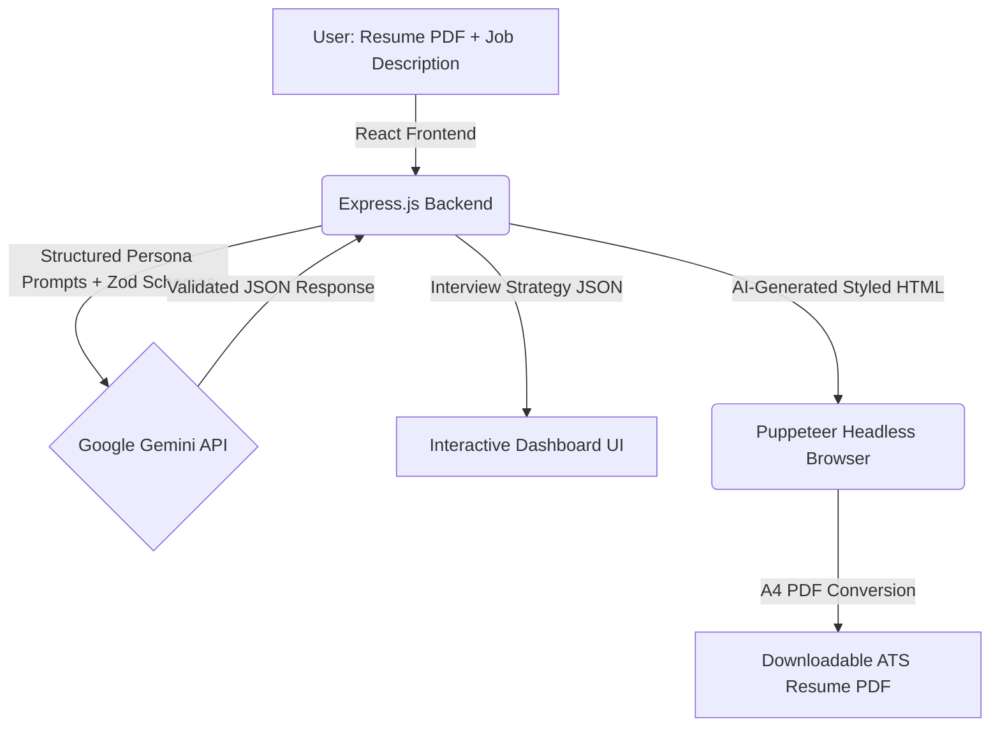

# PrepAI — AI-Powered Interview Strategy & Resume Optimizer ✨

<div align="center">
  
  
  
  
  

  <br /><br />

  <h3>🔗 <a href="https://ai-resume-1-z8ne.onrender.com">Live Demo → https://ai-resume-1-z8ne.onrender.com</a></h3>

  <p><i>⚠️ Hosted on Render's free tier — the app may take 20–30 seconds to wake up on the first visit. Please be patient!</i></p>
</div>

---

## 📌 What is PrepAI?

**PrepAI** is a comprehensive, end-to-end Generative AI application that helps job seekers bridge the gap between their current experience and their dream roles.

By analyzing a candidate's resume against a target job description, PrepAI uses the **Google Gemini API** — acting as a Principal Recruiter and Elite Engineering Manager — to generate a deeply personalized, hyper-tailored interview preparation strategy in seconds.

Built for the **GenForge - Mini Challenge (IEEE UVCE CodeFury 9.0)**.

---

## 🚀 The Problem It Solves

Most candidates prepare for interviews using generic YouTube videos or standard Q&A lists. This leads to:
- ❌ Wasted time studying irrelevant topics
- ❌ Missing key skill gaps the recruiter actually cares about
- ❌ Submitting a resume that doesn't match the job's keywords

**PrepAI** solves all of this with AI:
- ✅ Identifies exact skill gaps between your profile and the job
- ✅ Generates role-specific, non-generic technical & behavioral questions
- ✅ Creates a focused day-by-day preparation roadmap
- ✅ Rewrites your resume to be ATS-optimized for that exact role

---

## 🏗️ System Architecture



---

## 🌟 Key Features

| Feature | Description |
|---|---|
| 📊 **Match Score** | Mathematically rigorous 0–100% score based on tech stack, experience level & qualifications |
| ⚙️ **Technical Q&A** | 5–7 high-signal, role-specific questions with Interviewer Intent + Model Answer Strategy |
| 🧠 **Behavioral Insights** | STAR-method scenario questions tailored to the target role's team dynamics |
| 🗺️ **Prep Roadmap** | Concrete, day-by-day actionable schedule (e.g., "Implement LRU Cache", "Solve 3 Window Function SQL problems") |
| 🔍 **Skill Gap Analysis** | Severity-coded gaps (High / Medium / Low) pinpointing exactly what to learn |
| 📄 **ATS Resume PDF** | AI-generated, properly styled HTML resume converted to a downloadable PDF — rewritten to match the job's keywords |
| 🔐 **Auth System** | Secure JWT-based authentication with register, login, and protected routes |
| 📁 **Report History** | View all previously generated interview strategies from your dashboard |

---

## 🎮 How to Use the App

**Step 1 — Create a Free Account**
Visit [https://ai-resume-1-z8ne.onrender.com](https://ai-resume-1-z8ne.onrender.com) and click **"Create one free"** to register with your username, email, and password.

**Step 2 — Paste the Job Description**
On the dashboard, paste the full job description of the role you are targeting into the left panel. The more detailed it is, the better the output.

**Step 3 — Add Your Profile**
In the right panel, either:
- **Upload your resume** as a PDF (drag & drop or click to upload — recommended), **or**
- **Type a quick self-description** summarizing your experience, skills, and background.

**Step 4 — Generate Your Strategy**
Click **"Generate Strategy"**. Gemini AI will analyze your inputs and generate a complete, personalized interview strategy in approximately 30 seconds.

**Step 5 — Explore Your Interview Plan**
Your strategy dashboard includes:
- 📊 **Match Score** — A percentage showing how well your profile fits the role
- ⚙️ **Technical Questions** — Role-specific questions with Interviewer Intent & Model Answers (with one-click copy)
- 🧠 **Behavioral Questions** — STAR-method scenario questions with structured guidance
- 🗺️ **Prep Roadmap** — A day-by-day, actionable preparation schedule

**Step 6 — Download Your Tailored Resume**
Click **"Tailored Resume"** to download an ATS-optimized PDF resume automatically rewritten to align with the target job's keywords and requirements.

---

## 🛠️ Tech Stack

### Frontend
- **React.js** + **Vite** — Fast, optimized builds with HMR
- **SCSS** — Obsidian Dark Glassmorphism design system with micro-animations
- **Lucide React** — Clean, modern SVG icon library

### Backend
- **Node.js** + **Express.js** — RESTful API server
- **Google Gemini API** (`@google/genai`) — Core AI engine with model fallback (gemini-2.0-flash → gemini-1.5-flash)
- **Zod** + `zod-to-json-schema` — Strict structured JSON schema enforcement on AI outputs
- **Puppeteer Core** + **@sparticuz/chromium** — Serverless headless browser for PDF generation
- **JWT** + **cookie-parser** — Secure authentication tokens

### Deployment
- **Render** — Both frontend and backend deployed as separate web services

---

## 💻 Run Locally

### Prerequisites
- Node.js (v18+)
- Google Gemini API Key ([Get one free here](https://aistudio.google.com/app/apikey))

### Installation

1. **Clone the repository:**
   ```bash
   git clone https://github.com/karthikan7/AI-RESUME.git
   cd AI-RESUME
   ```

2. **Setup the Backend:**
   ```bash
   cd Backend
   npm install
   ```
   Create a `.env` file in the `Backend` directory:
   ```env
   GOOGLE_GENAI_API_KEY=your_gemini_api_key_here
   ```
   Start the server:
   ```bash
   npm start
   ```

3. **Setup the Frontend:**
   Open a new terminal:
   ```bash
   cd Frontend
   npm install
   npm run dev
   ```

4. Open `http://localhost:5173` in your browser.

---

## 🔮 Future Scope

- 🎤 **Audio Mock Interviews** — Practice generated questions verbally against an AI voice avatar using Web Speech API
- 🔗 **LinkedIn Integration** — Import candidate profiles via OAuth, eliminating manual resume uploads
- 📈 **Progress Analytics** — Track match score improvements over time as candidates complete preparation roadmaps
- 🌍 **Multi-language Support** — Generate interview strategies in regional languages

---

## 🔗 Links

| Resource | Link |
|---|---|
| 🌐 Live App | [https://ai-resume-1-z8ne.onrender.com](https://ai-resume-1-z8ne.onrender.com) |
| ⚙️ Backend API | [https://ai-resume-1-v6jj.onrender.com](https://ai-resume-1-v6jj.onrender.com) |
| 📦 GitHub Repo | [https://github.com/karthikan7/AI-RESUME](https://github.com/karthikan7/AI-RESUME) |
| 📄 Documentation | [README](https://github.com/karthikan7/AI-RESUME/blob/main/README.md) |

---

<div align="center">
  <i>Built with ❤️ for GenForge — IEEE UVCE CodeFury 9.0 (2026)</i>
</div>
